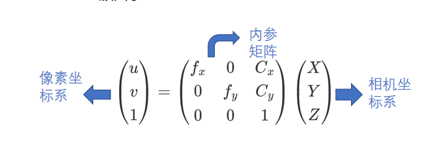
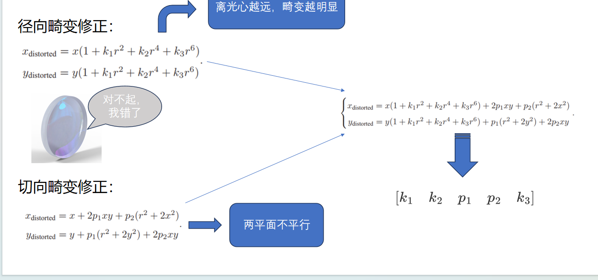

#### 请实现distorted.png的去畸变，文件夹内附有原图、畸变参数和示例程序
* 去畸变步骤：
    1. 由内参矩阵可知相机坐标系与像素坐标系之间的坐标转换，而数据的输入是像素坐标，所以要先用内参矩阵解出相机坐标系
    
    2. 得到像素坐标系和相机坐标系后在带入已经标定求得的畸变参数即可得出去畸变后的相机坐标系坐标
    
    3. 最后在将相机坐标带入内参矩阵坐标变换即可得到去畸变后的像素坐标，将其显示在图片上