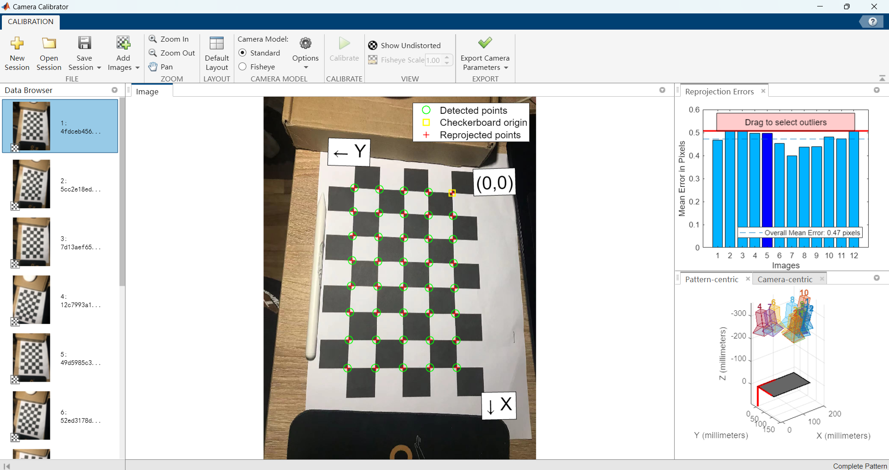
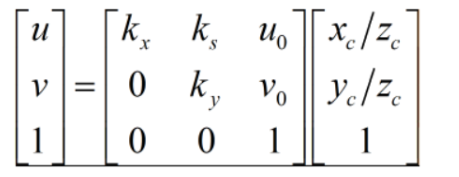
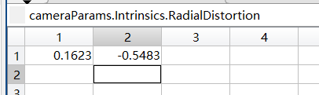
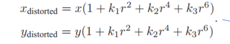
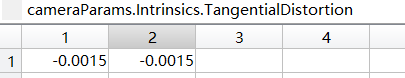
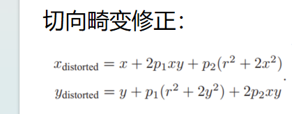

#### 请自行打印标定板图片或使用团队的标定板进行任意相机的标定，给出内参矩阵和畸变参数矩阵，并分析你的标定过程是否合理有效
* 标定过程
使用手机拍摄了15张标定板的不同角度的照片导入matlab进行相机标定，在拍照的时候手机要设置固定焦距进行拍摄，否则标定出来的参数误差很大
*导入matlab后如图：可以看到平均重投影误差小于0.5，说明标定结果有效*

*将标定参数导入到工作区后可以得到相机的内参矩阵和畸变参数*
**内参矩阵：**

参数含义：

**径向畸变参数：**

参数含义：（k1，k2，k3=0）

**切向畸变参数：**

参数含义：（p1，p2）
