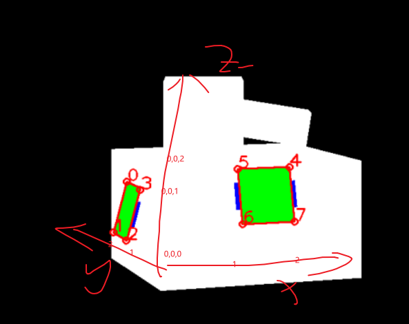
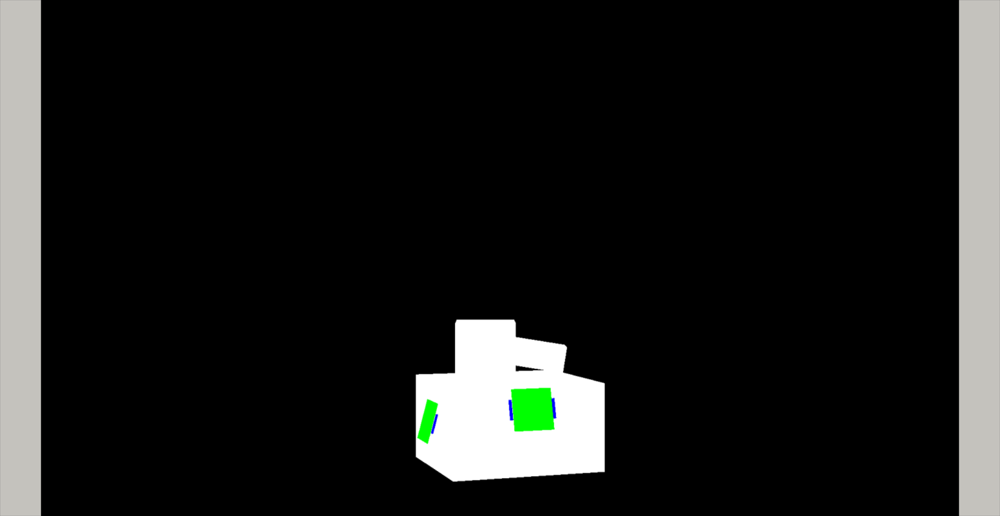
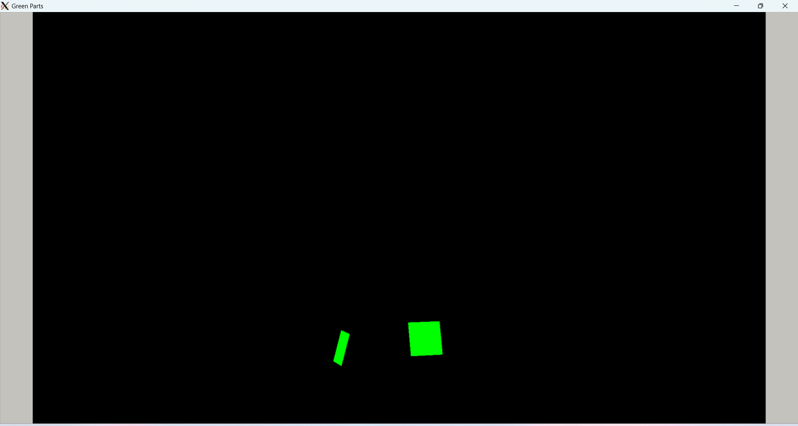
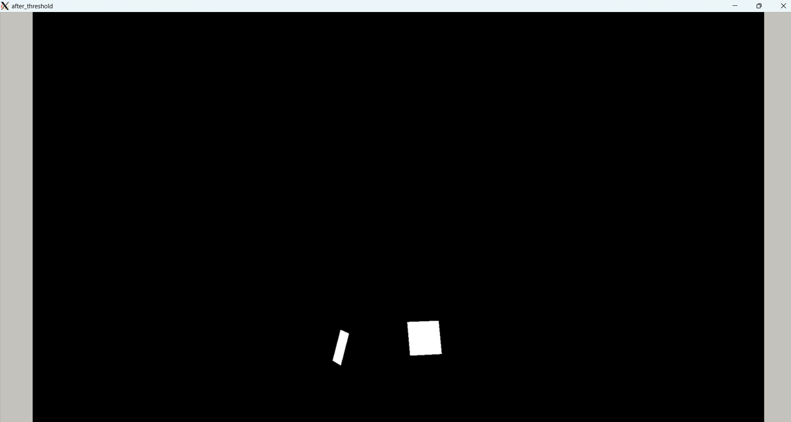
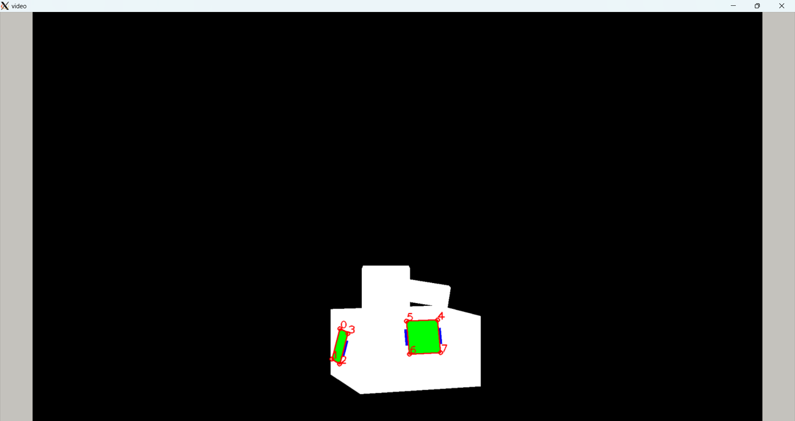

#### 实现pnp解算
* solvePnP函数原型：
```
CV_EXPORTS_W bool solvePnP( InputArray objectPoints, InputArray imagePoints,
                            InputArray cameraMatrix, InputArray distCoeffs,
                            OutputArray rvec, OutputArray tvec,
                            bool useExtrinsicGuess = false, int flags = SOLVEPNP_ITERATIVE );
```
1. 其中objectPoints为模型在三维里的实际坐标，因为没有明确给出所以随便大致设了个估计值，如图：*

2. imagePoints为特征点在像素坐标系下的坐标，这里选了八个点作为特征点
    * 识别步骤：
    1. 转换到HSV颜色空间，提取绿色部分
    2. 阈值分割得到灰度图
    3. 几何多边形拟合得到四边形的顶点坐标
    4. 在原图上画出顶点序号和顶点所在位置
* 图像处理中间过程如下所示：
*原图*

*颜色空间变换*

*阈值分割*

*标识顶点位置和索引*

3. 最后直接调用API解算PnP即可得到旋转向量和平移向量